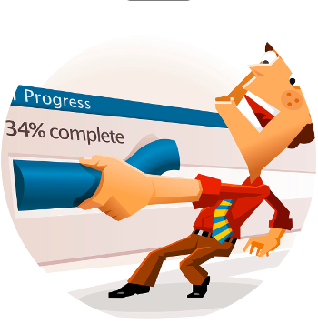
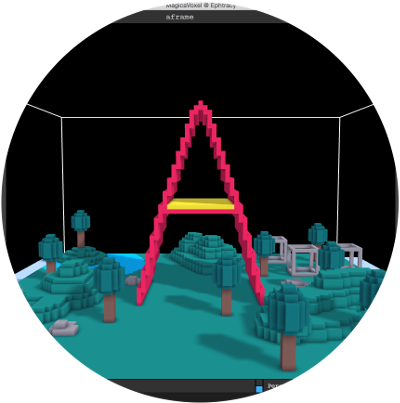
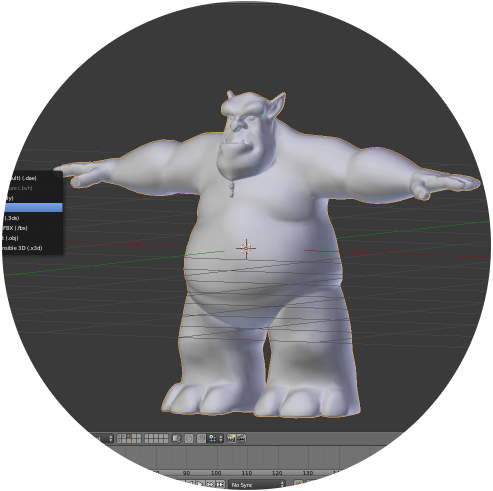
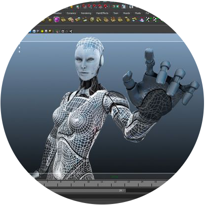
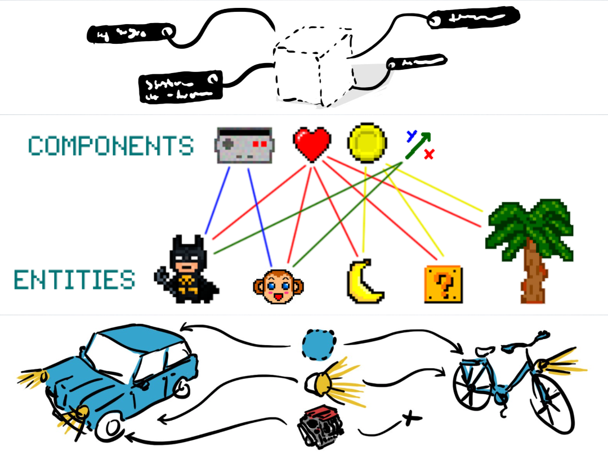
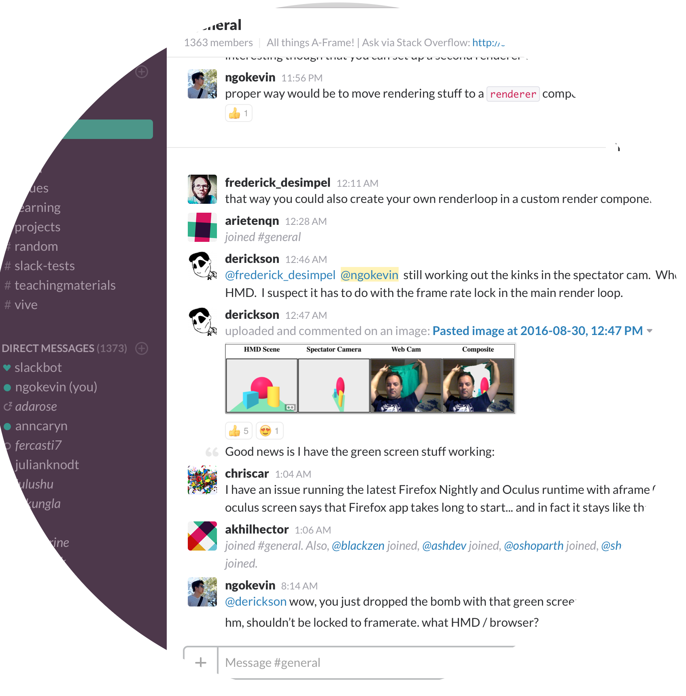

<!-- .slide: data-background="media/img/aframe.jpg" -->

<div class="talk-title">
  <h1>A-Frame</h1>
  <p>A web framework for building VR experiences</p>
  <p class="talk-info">
    Deepak Upendra | Mozilla India
  </p>
</div>

<!-- NOTES -->
- Onboard web developers into the 3D and VR world with easy-to-use tools
- Prototype WebVR experiences faster

------

# Virtual Reality

<!-- .slide: data-background-video="media/video/virtualreality.mp4" data-background-video-loop="true" data-state="state--bg-dark" -->

<!-- NOTES -->
- Ask how many have tried VR.
- Virtual reality is a technology platform that transports you to realistic, interactive, immersive 3D environments
- It's the next platform, will change how we work + play + communicate digitally, face of society

---

## Hardware

<div class="image-row">
  <div></div>
  <div></div>
  <div></div>
</div>

<div class="image-row">
  <div></div>
  <div></div>
  <div></div>
</div>

<!-- NOTES -->
- Backed by the largest corporations in the world, everyone wants in
- Range from cheap to expensive, tethered and untethered, controllers, tracking
- HTC Vive with Steam currently offers the most compelling experiences, but never know
- See a lot of different devices, systems, platforms competing against each other...

---

## Friction of VR Ecosystems

<div class="captioned-image-row">
  <div>
    
    <i>Gatekeepers</i>
  </div>
  <div>
    
    <i>Installs</i>
  </div>
  <div>
    
    <i>Closed</i>
  </div>
</div>

<!-- NOTES -->
- App stores and corporations control distribution: can take down or block content
- Downloads / installs are a barrier to consumption: small business pages
- Closed ecosystem: proprietary engines, steep learning curves, siloed experiences, fragmentation
- We want VR to be successful, so we want a platform without these points of friction. The answer is WebVR...

------

# WebVR

An open virtual reality platform with the advantages of **the Web**

<div class="captioned-image-row">
  <div>
    
    <i>Open</i>
  </div>
  <div>
    
    <i>Connected</i>
  </div>
  <div>
    
    <i>Instant</i>
  </div>
</div>

<!-- NOTES -->
WebVR is...virtual reality in the browser, powered by the Internet

Open:
- Anyone can publish
- Open source culture with open standards

Connected:
- Traverse worlds

Instant:
- Click a link on Twitter or Weibo, immediate VR experiences
- No installs
- Imagine for long tail experiences: shopping & personal spaces
- Great for long tail bite-sized experiences

Transition:
- Web has advantages that make it the best platform for the people
- Need to act to make it reality, can't wait for VR to bake and crystallize
- Get involved

---


Browser APIs that enable WebGL rendering to headsets and access to VR
sensors

https://w3c.github.io/webvr/

<!-- NOTES -->
API:
- Optimized rendering path to headsets
- Access position and rotation (pose) data

History:
- Initial WebVR API by Mozilla
- Working W3C community group
- Mozilla, Google, Samsung, Microsoft, community currently iterating WebVR 1.0 API

Not just a specification, it's implemented...

---

<div class="captioned-image-row">
  <div>
    
    <i>Firefox Nightly</i>
  </div>
  <div>
    
    <i>Chromium (Experimental)</i>
  </div>
  <div>
    
    <i>Samsung Internet</i>
  </div>
  <div>
    
    <i>Mobile Polyfill</i>
  </div>
</div>

<!-- NOTES -->
- Firefox + Chrome WebVR 1.0 hits release channels by early 2017
- Currently behind Nightly, custom builds, and flags
- Mobile Polyfill: use device motion / orientation sensors to polyfill on smartphones
- With all the browsers behind it...

---

<!-- .slide: data-background-video="media/video/boilerplate.mp4" data-state="state--bg-dark" -->

<div class="slide__boilerplate">
  <p>Import WebVR polyfill</p>
  <p>Set up camera</p>
  <p>Set up lights</p>
  <p>Initialize scene</p>
  <p>Declare and pass canvas</p>
  <p>Listen to window resize</p>
  <p>Install VREffect</p>
  <p>Instantiate renderer</p>
  <p>Create render loop</p>
  <p>Preload assets</p>
  <p>Figure out responsiveness</p>
  <p>Deal with metatags and mobile</p>
</div>

<!-- NOTES -->
- It's still too difficult to create WebVR experiences
- Huge obstacle if doing small prototypes and experiments
- Boilerplate needs updating with new versions of WebVR, three.js, and browser quirks
- Encapsulate all of that into one line...

---

```html
<a-scene></a-scene>
```

------

# A-Frame

<!-- .slide: data-background="media/img/aframe-rendered-full.png" -->

A declarative framework for building virtual reality experiences on the Web

<!-- NOTES -->
- Launched last December
- Why:
  - Easy for web developers to create VR content, without graphics knowledge
  - Prototype and experiment WebVR and VR UX faster
  - Vehicle to kickstart WebVR ecosystem

---

## Box in Three.js

```html
// Box in three.js
var geometry = new THREE.BoxGeometry(1, 2, 3);
var material = new THREE.MeshStandardMaterial({color: 'red'});
var box = new THREE.Mesh(geometry, material);
box.position.set(10, 0, 10);
scene.add(box);
```

---

## Box in A Frame

<!-- .slide: data-background="media/img/aframe.png" data-transition="slide-in none" -->

```html
<html>
  <script src="https://aframe.io/releases/0.3.2/aframe.min.js"></script>
  <a-scene>
	<a-box color="#4CC3D9" position="-1 0.5 -3" rotation="0 45 0"></a-box>


  </a-scene>
</html>
```
<!-- .element: class="stretch" -->

<!-- NOTES -->
- Just HTML
- Drop a script tag, no build steps
- Using Custom HTML Elements
- One line of HTML `<a-scene>` handles
  - canvas, camera, renderer, lights, controls, render loop, WebVR polyfill, VREffect
- Put stuff inside our scene...

---

## Shapes in A Frame

<!-- .slide: data-background="media/img/aframe.png" data-transition="fade-in slide-out" -->

```html
<html>
  <script src="https://aframe.io/releases/0.3.2/aframe.min.js"></script>
  <a-scene>
    <a-box color="#4CC3D9" position="-1 0.5 -3" rotation="0 45 0"></a-box>
    <a-cylinder color="#FFC65D" position="1 0.75 -3" radius="0.5" height="1.5"></a-cylinder>
    <a-sphere color="#EF2D5E" position="0 1.25 -5" radius="1.25"></a-sphere>
    <a-plane color="#7BC8A4" position="0 0 -4" rotation="-90 0 0" width="4" height="4"></a-plane>
    <a-sky color="#ECECEC"></a-sky>
  </a-scene>
</html>
```
<!-- .element: class="stretch" -->

<!-- NOTES -->
- Basic 3D primitives with Custom Elements
- Readable: HTML arguably most accessible language in computing
- Encapsulated: copy-and-paste HTML anywhere else and still work, no state or variables
- Quickly look at a live example...

---

## Hello World!

<!-- .slide: data-background="media/img/metaverse.png" -->

<div class="stretch" data-aframe-scene="scenes/hello-world.html"></div>

<!-- NOTES -->
- A-Frame scene by Ada Rose Edwards running from inside my HTML slides
- Works on desktop, Android, iOS, Samsung Gear VR, Oculus Rift, HTC Vive
- Could open up the DOM Inspector to change values live
- Since it's just HTML...

---

<!-- .slide: data-background="media/img/aframe.jpg" -->

## Works With Everything!

<div class="captioned-image-row">
  <div>
    
    <i>d3.js</i>
  </div>
  <div>
    
    <i>Vue.js</i>
  </div>
  <div>
    
    <i>React</i>
  </div>
  <div>
    
    <i>Redux</i>
  </div>
  <div>
    
    <i>jQuery</i>
  </div>
  <div>
    
    <i>Angular</i>
  </div>
</div>

<!-- NOTES -->

- Based on HTML, compatible with all existing libraries/frameworks
- Good reason to have HTML as an intermediary layer between WebGL/three.js
- All tools were on top of the notion of HTML
- Under the hood, A-Frame is an extensible, declarative framework for three.js...

---

<!-- .slide: data-background="media/img/aframe.jpg" -->

## Tools we know

<div class="captioned-image-row">
  <div>
    
    <i>MagicaVoxel</i>
  </div>
  <div>
    
    <i>Blender</i>
  </div>
  <div>
    
    <i>Maya</i>
  </div>
</div>

------

# Entity-Component-System

<!-- .slide: data-background="media/img/minecraft-blocks.png" -->



<!-- NOTES -->
- Composable, reusable, sharable bits of code
- All the power of JavaScript, three.js, and WebGL
- Developers empower other developers
- Is an entity-component framework
- Popular in game development, used by Unity
- All objects in scene are **entities** that inherently empty objects. Plug in
  **components** to attach appearance / behavior / functionality
- 2D web where every element was fixed
- 3D/VR is different, objects of infinite types and complexities, need an easy way to build up different kinds of objects

---

<!-- .slide: data-background="media/img/minecraft-blocks.png" data-transition="slide-in none" -->

## Composing an Entity

```html
<a-entity>
```
<!-- .element: class="stretch" -->

<!-- NOTES -->
- Start with an `<a-entity>`
- By itself, has no appearance, behavior, functionality
- Plug in components to add appearance, behavior, functionality

---

## Composing an Entity

<!-- .slide: data-background="media/img/minecraft-blocks.png" data-transition="none" -->

```html
<a-entity
  geometry="primitive: sphere; radius: 1.5"
  material="color: #343434; roughness: 0.4; sphericalEnvMap: #texture">
```
<!-- .element: class="stretch" -->

<!-- NOTES -->
- Syntax similar to CSS styles
- Component names as HTML attributes
- Component properties and values as HTML attribute value

---

## Composing an Entity

<!-- .slide: data-background="media/img/minecraft-blocks.png" data-transition="none" -->

```html
<a-entity
  geometry="primitive: sphere; radius: 1.5"
  material="color: #343434; roughness: 0.4; sphericalEnvMap: #texture"
  position="-1 2 4" rotation="45 0 90" scale="2 2 2">
```
<!-- .element: class="stretch" -->

---

## Composing an Entity

<!-- .slide: data-background="media/img/minecraft-blocks.png" data-transition="none" -->

```html
<a-entity
  geometry="primitive: sphere; radius: 1.5"
  material="color: #343434; roughness: 0.4; sphericalEnvMap: #texture"
  position="-1 2 4" rotation="45 0 90" scale="2 2 2"
  animation="property: rotation; loop: true; to: 0 360 0"
  movement-pattern="type: spline; speed: 4">
```
<!-- .element: class="stretch" -->

---

## Composing an Entity

<!-- .slide: data-background="media/img/minecraft-blocks.png" data-transition="none" -->

```html
<a-entity
  json-model="src: #robot"
  position="-1 2 4" rotation="45 0 90" scale="2 2 2"
  animation="property: rotation; loop: true; to: 0 360 0"
  movement-pattern="type: spline; speed: 4">
```
<!-- .element: class="stretch" -->

---

## Composing an Entity

<!-- .slide: data-background="media/img/minecraft-blocks.png" data-transition="none" -->

```html
<a-entity
  json-model="src: #robot"
  position="-1 2 4" rotation="45 0 90" scale="2 2 2"
  animation="property: rotation; loop: true; to: 0 360 0"
  movement-pattern="type: attack; target: #player"
  explode="on: hit">
```
<!-- .element: class="stretch" -->

---

## Writing a Component

<!-- .slide: data-background="media/img/minecraft-blocks.png" data-transition="none" -->

```js
AFRAME.registerComponent('my-component', {
  schema: {
    foo: {type: 'selector'},
    bar: {default: 256}
  },

  init: function () { // ... },
  update: function () { // ... },
  remove: function () { // ... },
  tick: function () { // ... }
});
```
<!-- .element: class="stretch" -->

```html
<a-box my-component="foo: #box; bar: 300""></a-box>
```

<!-- NOTES -->
- `schema`: defines how data is parsed from HTML
- Lifecycle methods:
  - `init`: component attached, like `componentDidMount`
  - `update`: component data update, like `componentWillReceiveProps`
  - `remove`: component detached, like `componentWillUnmount`
  - `tick`: run on every frame
- Properties:
  - `el`: reference to entity element
  - `data`: component data parsed from HTML
  - `object3D`: three.js object

---

<!-- .slide: data-background="media/img/minecraft-blocks.png" data-transition="none" -->	

## Baking an Entity

```js
AFRAME.registerPrimitive('a-ocean', {
  defaultComponents: {
    'ocean-waves': {intensity: 0.7}
  },

  mappings: {
    'reflection': 'material.sphericalEnvMap',
    'wave-intensity': 'ocean-waves.intensity'
  }
});
```

```html
<a-ocean reflection="url(sky.png)" wave-intensity="2"></a-ocean>
```

<!--Notes
- Bake the components into more traditional HTML
- API to create custom elements with default components and mappings
-->
  
---

<!-- .slide: data-background="media/img/standard-components.png" data-background-size="contain" -->

<!-- NOTES -->
- These are some components that ship with A-Frame
- A-Frame is fully extensible at its core so...

---

<!-- .slide: data-background="media/img/community-components.png" data-background-size="contain" -->

<!-- NOTES -->
- Community has filled the ecosystem with tons of components
- Components can do whatever they want, have full access to three.js and Web APIs
- The component ecosystem the lifeblood of A-Frame
- Physics, leap motion, particle systems, audio visualizations, oceans
- Drop these components as script tags and use them straight from HTML
- Advanced developers empowering other developers
- Working on collecting these components...

---

<div class="icon-title">
  
  <h2>Registry</h2>
</div>

<!-- .slide: data-background="media/img/aframe-side.png" -->

Curated collection of A-Frame components/shaders.

<a class="stretch" href="https://aframe.io/aframe-registry">
  <video loop data-src="media/video/registrypreview.mp4" data-autoplay></video>
</a>

<!-- NOTES -->
- Collecting them into the A-Frame registry
- Like a store of components that we make sure work well
- People can browse and search for components or install them....

---

## Inspector

<!-- .slide: data-background="media/img/inspector.png" data-state="state--bg-dark" -->

Visual tool for A-Frame. Just `<ctrl>+<alt>+i`.

<div class="stretch" data-aframe-scene="scenes/80s.html"></div>

------

<!-- .slide: data-background-video="media/video/a-painter.mp4" data-background-video-muted="true" data-state="state--bg-dark" -->

## A-Painter

Paint in VR in the browser.

<!-- NOTES -->
- A-Frame is very powerful
- 90+fps room-scale TiltBrush experience in a few weeks with just A-Frame

---

# aframe.io

<div class="captioned-image-row">
  <div>
    
    <i>75 contributors 3500 Stargazers</i>
  </div>
  <div>
    
    <i>1750 members on Slack</i>
  </div>
  <div>
    
    <i>100s of featured projects</i>
  </div>
</div>

<!-- NOTES -->
- Open source and inclusive project
- Most work done on GitHub
- Active community on Slack to share projects, interact, hang out, seek help
- Featured projects on the `awesome-aframe` repository and *A Week of A-Frame* blog

---

## Scenes by Organizations

- [360syria.com](http://360syria.com) (Amnesty International UK)
- [apps.npr.org/rockymountain-vr](http://apps.npr.org/rockymountain-vr/)
- [gurivr.com](https://gurivr.com/) (The Coral Project)
- [washingtonpost.com/graphics/business/mars-journey](https://www.washingtonpost.com/graphics/business/mars-journey/)
- [shopifyvr.myshopify.com](https://shopifyvr.myshopify.com/)

<!--Notes
-->

------

# Augmented Reality

<video class="stretch" data-src="media/video/argon.mp4" data-autoplay loop></video>

<!--Notes
- Not just a framework for VR, can also handle 3D and AR as well
- Prototype by Blair MacIntyre from Georgia Tech with Argon Browser
- Most predict AR to be even bigger market than VR
-->

------

# A-Frame in Drupal

- Import the A-Frame JavaScript file
- Add an ```html<a-scene> ``` element
- Create Awesome Virtual Reality content!!!

<br>

* For more information : https://www.drupal.org/project/aframe

------

<!-- .slide: class="slide__questionsx" data-background="" style="" -->

# Thanks !  <!-- .element: style="" -->

- Try it out [aframe.io](https://aframe.io)
- Twitter : AFrame | [@aframevr](https://twitter.com/aframevr)
- Join AFrame on Slack [aframevr-slack.herokuapp.com](https://aframevr-slack.herokuapp.com/)

<br/><br/>

<!--Notes
- Homepage which has examples, documentation, blog
- Slack extremely active, core team responsive, over 1300 people
- Keep up to date by following on Twitter
-->

------

# Links

- Telegram : [WebVR India : telegram.me/WebVRIndia](https://telegram.me/WebVRIndia)
- Telegram : [Mozilla VR : telegram.me/MozillaVR](https://telegram.me/MozillaVR)
- Tweet With : #WebVRCamp, @aframevr, @mozillavr, @udeepak